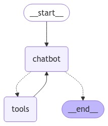
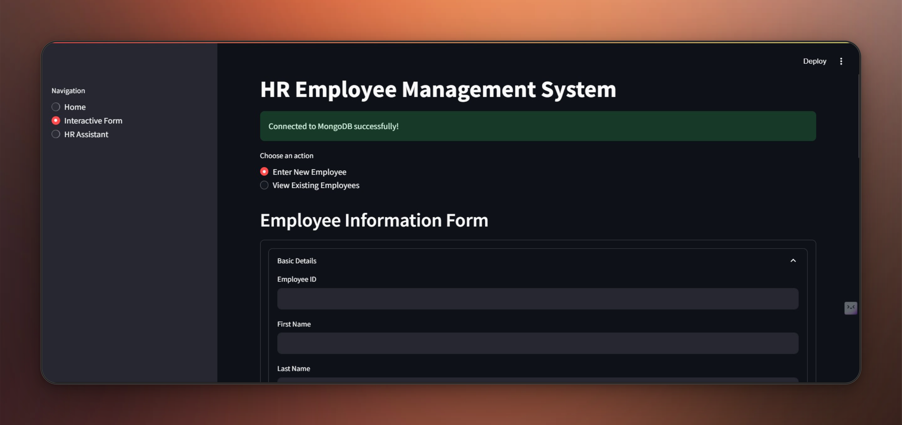
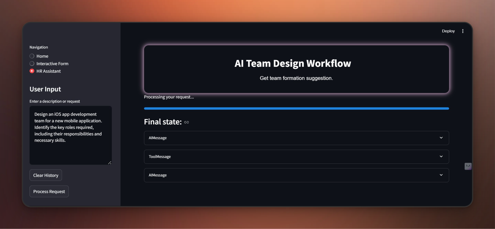

# HR_Assistant_Agent

The **HR Assistant Agent** is an AI-powered application designed to streamline HR management tasks. This application leverages the power of *MongoDB*, *LLMs (Used Groq-Mistral)*, and agentic workflows using *Langchain agent* to provide intelligent and efficient solutions for employee record management, team formation, and natural language query resolution.

---

## Directory Structure

```plaintext
saniyasj-HR_Asssitant_Agent/
├── config.py                  # Configuration settings for the application
├── main.py                    # It is just to check if the agent is working well
├── agent/                     # Core agent functionality
│   ├── mongodb_utils.py       # MongoDB utility functions
│   ├── llm_utils.py           # LLM integration utilities
│   ├── __init__.py            # Initialization file for the `agent` module
│   └── workflow.py            # Defines agent workflows
├── app.py                     # Entry point for running the application
├── __init__.py                # Root module initializer
├── notebooks/                 # Jupyter notebooks for data analysis and generation
│   ├── data_generator.ipynb   # Implementaion notebook
│   └── data/                  # Data directory
│       └── synthetic_data_employees.csv  # Sample employee data
├── requirements.txt           # Required Python dependencies
├── database/                  # Database management utilities
│   ├── db_connection.py       # MongoDB connection setup
│   ├── __init__.py            # Initialization file for `database` module
│   └── data_generation.py     # Scripts to generate string and embedding's
├── streamlit_app.py           # Streamlit app for Assistant interaction
├── style.css                  # Styling for the frontend
├── README.md                  # Project documentation
└── form.py                    # Form handling logic
```

---

## Features

- **Employee Record Management**: Efficiently manage employee data using MongoDB.
- **Intelligent Query Resolution**: Use natural language to retrieve employee records or form project-specific teams.
- **Team Formation**: Automatically suggest teams based on project requirements.
- **Agentic Workflows**: Dynamic workflows powered by LLMs to support HR operations.
- **Interactive UI**: Intuitive Streamlit-based interface for seamless interaction.

---

## Installation

1. Clone the repository:
   ```bash
   git clone https://github.com/saniyasj2004-cmd/HR_Assistant_Agent/blob/main/HR_Assistant_Agent/HR_Assistant_Agent/README.md
   ```

2. Navigate to the project directory:
   ```bash
   cd HR_Assistant_Agent
   ```

3. Install dependencies:
   ```bash
   pip install -r requirements.txt
   ```

4. Run the application:
   ```bash
   python app.py
   ```

---

## Usage

- **Run the Streamlit App**:
  ```bash
  streamlit run streamlit_app.py
  ```
- Access the application via your local web browser.

---

## Agent Workflow Diagram


Add an image here to illustrate the agent workflow. You can include a diagram showing the interaction between components such as MongoDB(Tool) , LLMs (chatbot), and the user interface.

---

## Application Screenshots

Include screenshots here to showcase the interface and features of the application, such as:
- Employee data management

- Team formation suggestions


---

## Contributing

Contributions are welcome! Please follow these steps:

1. Fork the repository.
2. Create a new branch for your feature or bug fix.
3. Commit your changes and push to your branch.
4. Submit a pull request for review.

---

## Contact

For questions or feedback, please contact:

- **Name**: Saniya S J
- **Email**: saniyasj2004@gmail.com


---

Enjoy using the HR Assistant Agent! Let know your thoughts and suggestions.

